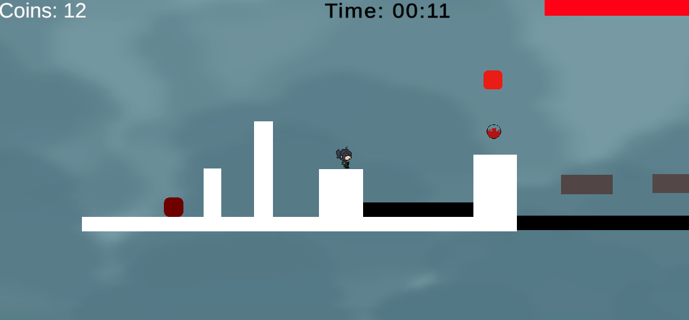
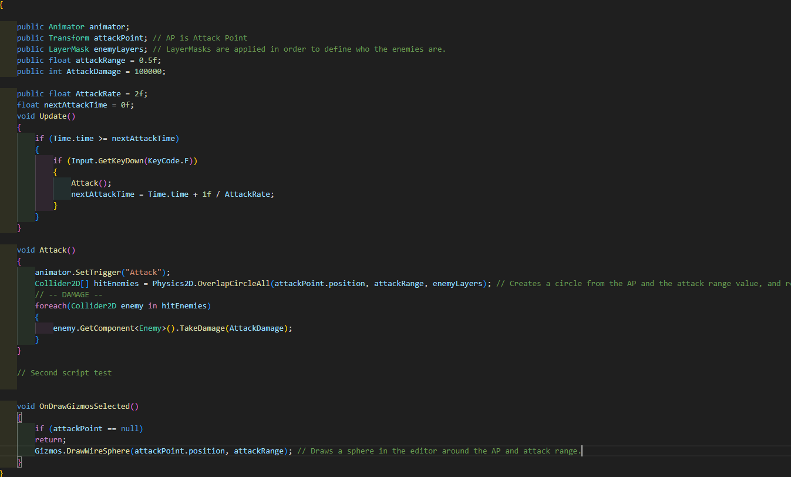

# The Odyssey 
The Odyssey is a combat platformer encouraging emphasis on speed and collection. The game focuses on getting from one goal to another, while collecting coins along the way to spend on future levels. While on this adventure, or odyssey, the player will encounter enemies that try to stop them, or dangerous obstacles. 

A screenshot showing gameplay.
## Story
With my multimedia student, we came up with a basis for a story where the main character would live in a dystopian landscape where megacorporations take control of the Earth's resources, governing the world and taking the people's will for themselves. The main character is a female mercenary working to liberate the world from the corporation's gripping on the continents. The game title, 'The Odyssey' is inspired off the novel of the same name, and is given this name to simulate the same large and grand adventure that Odysseus had in the novel.
## Table of Contents 
- [Controls](#controls)

- [Features and Mechanics](#features) 

- [Goals](#goals)

- [Developer Documentation](#dev)

- [Issues](#issues)

- [Acknowledgements](#credits)
## :video_game: Controls 
| Keybinds  | Actions |
| ------------- | ------------- |
| Space  | Jump  |
| F | Attack  |
| W | Move Forward |
| A | Move Left |
| D | Move Right |
## :white_check_mark: Features and Working Mechanics 
- Dashing, which is a central mechanic of the game and gives the player an option to flee the enemies instead of fighting
- [Jumping](https://www.youtube.com/watch?v=K1xZ-rycYY8), which is another central mechanic for platforming.
- [Wall Sliding & Wall Hopping](https://www.youtube.com/watch?v=O6VX6Ro7EtA)
- [Attacking](https://www.youtube.com/watch?v=sPiVz1k-fEs)
- Collectables, which tally up a score.
- A timer that encourages players to beat the game as fast as possible.
- Movement system which rewards when players take advantage of it.

## Developer Documentation 

Image of the combat mechanics of my game. Used from this [tutorial created by Brackeys,](https://www.youtube.com/watch?v=sPiVz1k-fEs) or look at the features and click on the hyperlink for attacking.

### :dart: Goals 

While most features of my game do work, I do still find myself unsatisified by some features that I was not able to implement earlier. These goals include:
* Implementing proper art assets into my game 
* Expanding the game and adding more content. During development, I was quite slow and was not able to implement many of the features I wished to add. Features that could have been included would be things such as more varied enemies for the player to evade/attack, creative obstacles that would require players to take advantage and experiment with the mechanics, and score that would carry over to other levels, making collecting coins actually worth something valuable.
* Making more levels, as finishing a level causes a scene with the exact same structure as the first level to be played.

## :red_circle: Major/Minor issues during Development 

Throughout my project, I ran into a variety of issues that would provide a challenge to me. While most of these issues are fairly minor, there are a few outliers that may need further evaluation at a later time. These issues include:
* Flying enemies - While the enemy would use the prefab provided, it would later erase itself and not be able to generate another projectile, which gave me a wide plethora of console issues.
* Implementing sprites - I had to completely avoid using some of my assets provided as animation sprites for the same character were of different sizes, showing the full sprite sheet png when the animation would show.
* Creating scripts - I had to learn how to create scripts while making scripts, slowing down the progress of my work.

### Authors

Contributors names and contact info

- [Princy D](https://github.com/Princy-Dumais), who is me, and is the main developer of the game.
- [Corin Barker](https://github.com/Cornbarker91), who created some of the art assets for the game.
- Lisa Nguyen, who also provided some of the assets for the game.

## Version History

* 0.2
    * Various bug fixes and optimizations
    * See [commit change]() or See [release history]() or see [branch]()
* 0.1
    * Initial Release

### License

This project is licensed under the [GPL-3.0] License - see the LICENSE.md file for details.

## Acknowledgments 

Inspiration, code snippets, etc.
- [Brackeys](https://github.com/Brackeys), the main developer who I followed tutorials for. 
