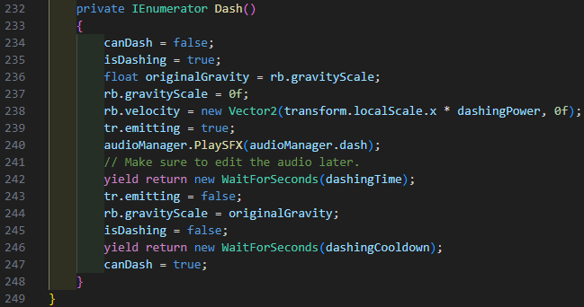

# The Odyssey 
https://github.com/user-attachments/assets/bc50eb2a-85c2-4196-aafe-1347d7e2b91a 

The Odyssey is a combat platformer encouraging emphasis on speed and collection. The game focuses on getting from one goal to another, while collecting coins along the way to spend on future levels. While on this adventure, or odyssey, the player will encounter enemies that try to stop them, or dangerous obstacles. 

A screenshot showing gameplay.
## :pencil: About

An image showing brief combat.

The Odyssey as mentioned before is a game focused on speed and precision, requiring the player to platform through levels and fight enemies off. This game was made in about 3 months, and was done as for an assignment in my class. '
> [!TIP]
> Wall-hopping can be used as an exploit to raise your elevation.

### Objective 
As mentioned before, the main objective of the game is to get to the goal at the end of the game while avoiding enemies and collecting obstacles.
### :book: Story
With my multimedia student, we came up with a basis for a story where the main character would live in a dystopian landscape where megacorporations take control of the Earth's resources, governing the world and taking the people's will for themselves. The main character is a female mercenary working to liberate the world from the corporation's gripping on the continents. The game title, 'The Odyssey' is inspired off the novel of the same name, and is given this name to simulate the same large and grand adventure that Odysseus had in the novel.
## Table of Contents 
- [Controls](#controls)

- [Features and Mechanics](#features) 

- [Goals](#goals)

- [Developer Documentation](#dev)

- [Issues](#issues)

- [Acknowledgements](#credits)
## :video_game: Controls 
| Keybinds  | Actions |
| ------------- | ------------- |
| Space  | Jump  |
| F | Attack  |
| W | Move Forward |
| A | Move Left |
| D | Move Right |
## :white_check_mark: Features and Working Mechanics 
- [Dashing,](https://www.youtube.com/watch?v=2kFGmuPHiA0) which is a central mechanic of the game and gives the player an option to flee the enemies instead of fighting. This is likely one of the most important features in this game, and will be the mechanic I build my levels around. 
- [Jumping](https://www.youtube.com/watch?v=K1xZ-rycYY8), which is another central mechanic for platforming.
- [Wall Sliding & Wall Hopping.](https://www.youtube.com/watch?v=O6VX6Ro7EtA) 
- [Attacking](https://www.youtube.com/watch?v=sPiVz1k-fEs)
- [Collectables,](https://learn.unity.com/course/roll-a-ball/tutorial/detecting-collisions-with-collectibles-1?version=6.0) which tally up a score.
- A [timer](https://www.youtube.com/watch?v=POq1i8FyRyQ) that encourages players to beat the game as fast as possible. The timer is also another way to artifically boost the difficult and enjoyment of the game, adding a layer of replayability to it. 
- [Ranged Enemies.](https://www.youtube.com/watch?v=--u20SaCCow&pp=0gcJCQYKAYcqIYzv) Ranged enemies do function, but they have a major issue which will be addressed later in this document. 

## To-Do List
- [x] Basic Movement (For example jumping, moving, dashing) 
- [x] Combat Mechanics 
- [x] Timer
- [x] Collectables/Coins 
- [x] Health and Death system
- [x] Camera follows player
- [ ] More levels
- [ ] Moving Enemies
- [ ] Fix/Substitution script for ranged enemies
## Developer Documentation 

Image of the combat mechanics of my game. Used from this [tutorial created by Brackeys,](https://www.youtube.com/watch?v=sPiVz1k-fEs) or look at the features and click on the hyperlink for attacking.

## Goals 
While most features of my game do work, I do still find myself unsatisified by some features that I was not able to implement earlier. These goals include:
* Implementing proper art assets into my game 
* Expanding the game and adding more content. During development, I was quite slow and was not able to implement many of the features I wished to add. Features that could have been included would be things such as more varied enemies for the player to evade/attack, creative obstacles that would require players to take advantage and experiment with the mechanics, and score that would carry over to other levels, making collecting coins actually worth something valuable.
* Making more levels, as finishing a level causes a scene with the exact same structure as the first level to be played. I'd like to create more creative levels though, as the game is quite easy at this stage. 
* Advanced enemies. Most enemies either
  - Patrol an area or fly in an area or
  - Stand still, which can be seen more prominently with the red square 'enemy' at the beginning of the game. 

## Abnormalities

Image of the movement mechanics in the game. 

### Major/Minor issues during Development 

While I did learn a lot of C# during my time on this project, I ran into a variety of issues that would provide a challenge to me, and some errors which have not been fixed. Although most of these issues are fairly minor, there are a few outliers that may need further evaluation at a later time. These issues include:
* Flying enemies - They are a large issue in development. Although they work temporarily, the projectile used would later delete itself and not be able to fire any additional projectiles instead providing a plethora of errors that clog the console up. The error likely comes from an error from what the enemy uses to shoot, which is a temporary object in the scene. For an unknown reason to me, a prefab would not work for this enemy. It would be an ideal outcome if I were to deduce a method to fix this conundrum. Ranged enemies also appear to not do damage to the player. Presently, it is unknown whether this comes from the health orb adding excess health which would not show up on the asset, or if a logic error is present, preventing the player from taking damage.  
* Implementing sprites - I had to completely avoid using some of my assets provided as animation sprites for the same character were of different sizes, showing the full sprite sheet png when the animation would show.
* Creating scripts - I had to learn how to create scripts while learning C#, slowing down the progress of my work.
* Wallhopping. Players can gain extra height by wallhopping off a wall, which is a minor oversight that shouldn't pose too much of an issue.
* Getting sprites in the first place. Due to issues, it was a little difficult for us to get sprites. Later in time, I plan to implement free stock images which shall boost the appeal and appearance of my game. 
* Story implementation, as the game does not have any dialogue or intro that show what story events occur. Once the game's initial issues are fixed, I will start to add these features. 
* Speed of development, as it was the main factor to unfinished goals and features. In fact, most of my time was dedicated to learning C# and watching tutorials.
* Console errors are frequent while playing the game. Although they should not tamper with the game, they are a nuisance.

## Assets

## Mechanics in the game 

### Dash Mechanic

This images shows the dash function in my script. It is set in a IEnumerator to set off a sequence of events when the shift key is pressed. As soon as the shift key is pressed, isDashing is set to true allowing the player to dash and canDash is set to false to prevent the player from dashing during the actual event. The gravity scale is set to 0 to allow for smooth movement along a line. Next, a Vector2 is used which multiplies the transform value by the dashing power (7f).

The player dashes forwards and emits a trail while playing the dash audio set. After, the system waits for a set amount of time called the dashingTime (0.2f). Finally, the system sets emitting to false, sets the gravity scale back to normal and sets isDashing to false. The system then waits for the dashingCooldown (1f) to expend, then sets canDash to true.

I wanted to implement the dash mechanic to create a more varied experience, and give the player a movement option during portions of the level where there is not much going on. This feature is also intended for me to build the game around, and create unique situations. Later, I could make it so the dash mechanic is another way for the player to fight, with the player dashing into enemies and bouncing off them.

### :hearts: Health System and Death 

A section of the code showing the death system.

The health system in this game is quite simplistic. First, a few variables are declared, setting the initial values for the player. Those variables are then linked to a UI object ingame which would display the player's current health. When the player starts the game, a line set in the void start would set the current health to the maximum health. The next line after that would set the health bar's value to the max health of the player.

If a player takes damage from an external source, the game would then take the value from the damage variable of the enemy, and minus the health value by the damage. After that, the script would then set the health bar's value to the player's current health. When a player dies, the player game object is destroyed, timescale is set to zero and a UI element known as 'GameOver' would be set to true. allowng the player to restart the game.

The health system is here to add more pressure into the game, and give the player more incentive to play cautiously. A health orb is present early in the first level, but it cannot be used because of the player being unable to take damage before they can use it. The health system also appears to have some issues in game, as enemies can do damage to you without damage showing up on the health bar. This also may be happening because of the health orb around the ranged enemy adding an excess of hp, making it so the player appears to not take damage on the next hit. There also used to be an issue where stepping into a death zone (black pits) at an angle will not kill but rather negate some of that damage. I fixed this by increasing the damage number making it so the player will be killed regardless of how much HP they have. 

## Link to scripts
- [Player Controller](Assets/Scripts/PlayerController.cs)

- [Player Combat](Assets/Scripts/PlayerCombat.cs) 

- [Enemy Projectiles](Assets/Scripts/EnemyProjectile.cs)

- [Enemy Projectile Prefab](Assets/Scripts/EnemyProjectilePrefabScript.cs)

- [Main Menu](Assets/Scripts/MainMenu.cs)

- [Timer](Assets/Scripts/Timing.cs)

## Version History
Version History may be seen here.
    * Various bug fixes and optimizations
    * See [commit change]() or See [release history]() or see [branch]()

### License

This project is licensed under the [GPL-3.0](LICENSE) License - see the LICENSE.md file for details.

## Acknowledgments 

Mainly code tutorials.
- [Brackeys](https://github.com/Brackeys), a video creator who I followed tutorials from.
- [Princy D](https://github.com/Princy-Dumais), who is me, and is the main developer of the game.
- [Corin Barker](https://github.com/Cornbarker91), who created some of the art assets for the game.
- Lisa Nguyen, who also provided some of the assets for the game. I could not find an account.
